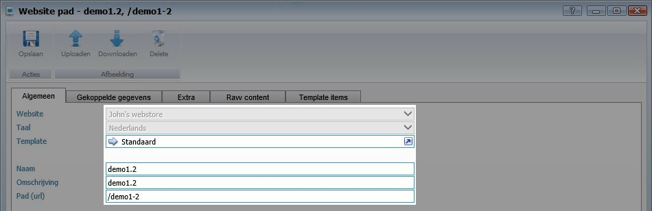
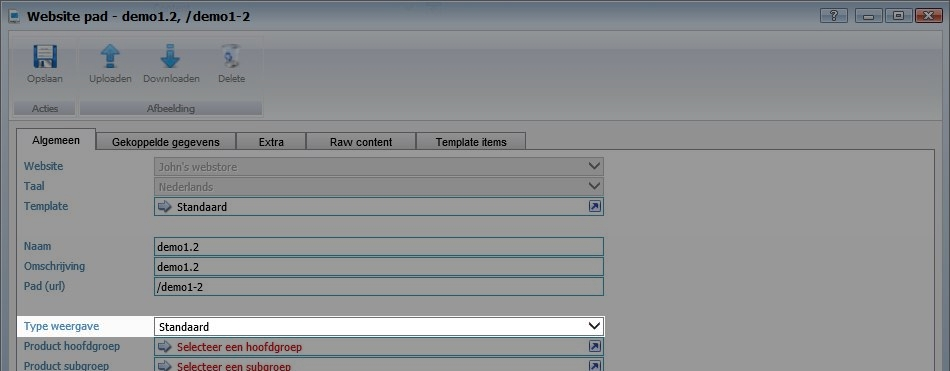
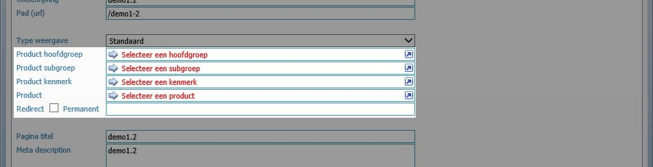
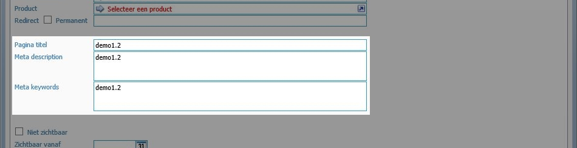
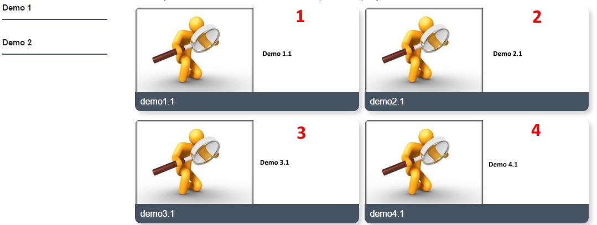

<properties>
	<page>
		<title>Website menupaden</title>
		<description>Website menupaden</description>
		<context>website-path</context>
	</page>
	<menu>
		<position>Modules N - Z / Webshop</position>
		<title>Menu paden</title>
		<sort>f</sort>
	</menu>
</properties>

# Menu paden #
In deze rubriek zal worden beschreven hoe menupaden aangemaakt dienen te worden ten behoeve van de webshop.

Een menupad heeft een menu nodig. Het pad verwijst door naar de pagina waar de producten instaan echter wordt de naam uit het menu op de site weergegeven.

Zoek in het startmenu naar **Website paden** en klik op **Toevoegen**

## Algemene instellingen ##

- **Website**: Selecteer de website waar het pad in aangemaakt dient te worden
- **Taal**: Selecteer de taal van de website
- **Template**: Selecteer het template
- **Naam**: Geef de naam van het pad op
- **Omschrijving**: Geef een omschrijving in van het pad (deze wordt automatisch overgenomen van de naam, tenzij deze handmatig wordt aangepast.)
- **Pad (url)** : Geef padnaam (voorbeeld.nl/**padnaam**) in van het pad (deze wordt automatisch overgenomen van de naam, tenzij deze handmatig wordt aangepast.) 

## Weergavetype ##

- **Type weergave**: Er kan worden gekozen uit twee verschillende weergavetype. De weergave bepaald hoe producten worden weergegeven.

### Standaard (De producten worden met onderstaande weergave direct getoond) ###

### Groep weergave - Gekoppelde weergave (Er wordt eerst een keuzeveld getoond met verschillende paden) ###

## Onderdeel koppelen ##

Selecteer het onderdeel waar het pad aan gekoppeld dient te worden. Let op dit kan slechts één onderdeel zijn. De keuze bestaat uit:

- **Product hoofdgroep**
- **Product subgroep**
- **Product kenmerk**
- **Product**
- **Redirect Permanent**

## Paginatitel en metateksten ##

- **Pagina titel**: Vul hier de paginatitel in (deze wordt automatisch overgenomen van de naam, tenzij deze handmatig wordt aangepast.)
- **Meta description**: Vul hier de meta tekst in (deze wordt automatisch overgenomen van de naam, tenzij deze handmatig wordt aangepast.)
- **Meta keywords**: Vul hier de keywords in (deze wordt automatisch overgenomen van de naam, tenzij deze handmatig wordt aangepast.)

### Weergave type Groep weergave - Gekoppelde gegevens ###

Indien bij weergavetype is gekozen voor "Groep weergave - Gekoppelde weergave" is het mogelijk de paden aangeven welke gekoppeld dienen te worden aan dit pad.

- **Website pad**: Hiermee is het mogelijk om een pad te selecteren en te koppelen.
- **Bewerken**: Selecteer het gewenste pad om sorteerwaarde aan te passen. 
- **Inzien**: Selecteer het gewenste pad om deze in te zien
- **Verwijderen**: Selecteer het gewenste pad om deze te verwijderen
- **Exporteren**: Hiermee kunnen alle regels worden geëxporteerd naar Excel

Door de regel te bewerken is het mogelijk om de sortering aan te passen. Met de sortering kan de positie van de afbeeldingen worden bepaald.

Standaard is de sortering van link naar rechts en boven naar beneden. Zie onderstaand voorbeeld.

# Extra #

Het is mogelijk om boven en onder de productafbeeldingen een tekst te plaatsen. Ga hiervoor naar het tabblad **Extra**.

Tekst ingegeven voor boven de afbeeldingen

Voorbeeld ingegeven tekst op website

