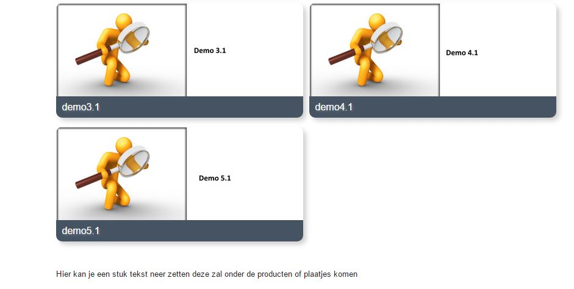

<properties>
	<page>
		<title>Website menupaden</title>
		<description>Website menupaden</description>
		<context>website-path</context>
	</page>
	<menu>
		<position>Modules N - Z / Webshop</position>
		<title>Menu paden</title>
		<sort>f</sort>
	</menu>
</properties>

# Menu paden #
In deze rubriek zal worden beschreven hoe menupaden aangemaakt dienen te worden ten behoeve van de webshop.

Een menupad heeft een menu nodig. Het pad verwijst door naar de pagina waar de producten instaan echter wordt de naam uit het menu op de site weergegeven.

Zoek in het startmenu naar **Website paden** en klik op **Toevoegen**

## Algemene instellingen ##

- **Website**: Selecteer de website waar het pad in aangemaakt dient te worden
- **Taal**: Selecteer de taal van de website
- **Template**: Selecteer het template
- **Naam**: Geef de naam van het pad op
- **Omschrijving**: Geef een omschrijving in van het pad (deze wordt automatisch overgenomen van de naam, tenzij deze handmatig wordt aangepast.)
- **Pad (url)** : Geef padnaam (voorbeeld.nl/**padnaam**) in van het pad (deze wordt automatisch overgenomen van de naam, tenzij deze handmatig wordt aangepast.) 

## Weergavetype ##

- **Type weergave**: Er kan worden gekozen uit twee verschillende weergave type. De weergave bepaald hoe producten worden weergegeven.

### Standaard (De producten worden met deze weergave direct getoond) ###

### Gekoppelde weergave (Er wordt eerst een keuzeveld getoond met verschillende paden) ###

## Onderdeel koppelen ##

Selecteer het onderdeel waar het pad aan gekoppeld dient te worden. Let op dit kan slechts één onderdeel zijn. De keuze bestaat uit:

- **Product hoofdgroep**
- **Product subgroep**
- **Product kenmerk**
- **Product**
- **Redirect Permanent**

- **Pagina titel**: Vul hier de paginatitel in (deze wordt automatisch overgenomen van de naam, tenzij deze handmatig wordt aangepast.)
- **Meta description**: Vul hier de meta tekst in (deze wordt automatisch overgenomen van de naam, tenzij deze handmatig wordt aangepast.)
- **Meta keywords**: Vul hier de keywords in (deze wordt automatisch overgenomen van de naam, tenzij deze handmatig wordt aangepast.)

# Gekoppelde gegevens #

Als je een gekoppelde weergave heb aangegeven bij type weergave kan je hier de paden aangeven welke gekoppeld moeten worden aan deze pad

- Website pad
	- Om toe te voegen klikt u op de button.
- Bewerken
	- Om te bewerken selecteert u een regel en klikt op de button Bewerken.
- Inzien
- Verwijderen
	- Om te verwijderen selecteert u een regel en klikt op de button Verwijderen.
- Exporteren

Door op de regel dubbel te klikken kan je een sorteringswaarde aangeven
hij plaatst het altijd:

- 1	2
- 3	4
- 5 6
- enzo

# Extra #

- Extra menu's
- Boven content
	
	
- Onder content
	
	

----------
