<properties>
	<page>
		<title>Product-zichtbaar</title>
		<description>Product-zichtbaar</description>
	</page>
	<menu>
		<position>Modules N - Z / Webshop</position>
		<title>Product zichtbaar</title>
		<sort>f</sort>
	</menu>
</properties>

# Product zichtbaar op de website #

Er zijn 2 soorten websites welke in het Blauw is aangegeven is alleen beschikbaar voor de v2 versie

Wat er allemaal aangezet moet worden om je product zichtbaar te maken op je website kan je hieronder vinden

Op de productkaart heb je een aantal gegevens nodig welke ervoor zorgen dat dit product zichtbaar word op je website

**Tabblad Informatie**

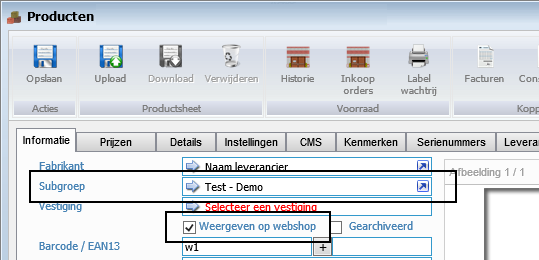

- het product dient aan een subgroep te hangen
	- (bij het instellen van de website kan je aangeven op welke pagina welke subgroep getoond zal worden)

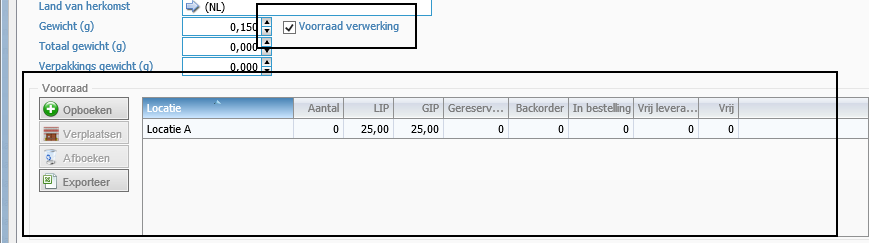

- Als je een voorraadverwerking wilt bijhouden dien je het vinkje aan te zetten
	- en je product voorzien van de juiste voorraad
- Je kan deze optie ook uitlaten, op de website zal dan het product worden getoond, en altijd besteld kunnen worden 

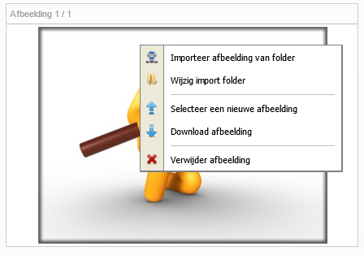

- Een afbeelding toevoegen (via rechtermuisknop op het vakje van de afbeelding krijg je de opties te zien)
	- De afbeelding de op 1 staat is je hoofd afbeelding (deze zal als eerste getoond worden)
	- De andere worden in de volgorde van hoe ze in de productkaart staan weergegeven

**Tabblad Prijzen**

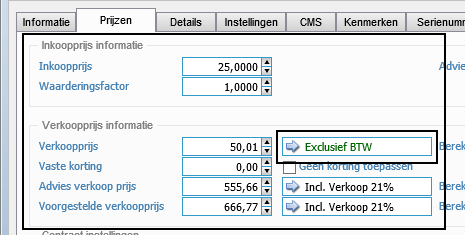

- Het product een prijs geven
	- Aan deze prijs een btw-code hangen

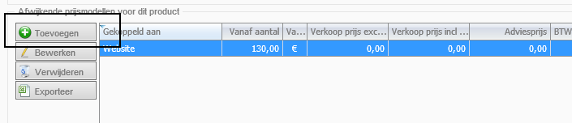

- Een prijsmodel toevoegen

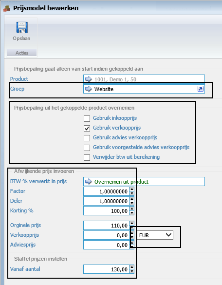

- Een groep selecteren
- Een prijsbepaling (overnemen uit het product)
	- Hier kan je 1 van de vinkjes kiezen, de prijs word dan overgenomen welke is ingegeven bij prijzen
- Afwijkende prijsbepaling
	- Je kan er ook voor kiezen om een afwijkende prijs te laten weergeven op de website, maak een keuze uit een van de opties
- Een valuta aangeven

**Tabblad CMS**

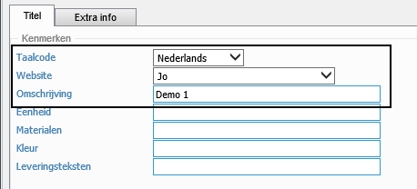

- Een taalcode aangeven
- Aangeven voor welke website het bedoeld is
	- indien niet ingevuld zal hij beschikbaar zijn bij alle websites
- Een Omschrijving invullen
	- Deze is te zien in het overzicht bij de CMS (handig als je meerdere regels hier hebt staan)
	- 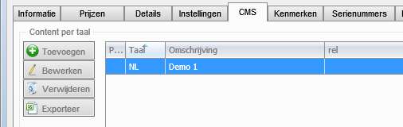

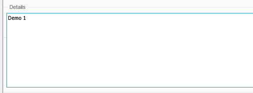

- De details invullen voor je product.
	- Deze wordt overgenomen van het eerste tabblad van de productkaart, eventueel kan je deze aanvullen naar wens 
	- 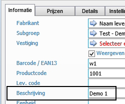
	- Deze wordt niet standaard gevuld, Indien je niks ingevuld word de beschrijving overgenomen van het eerste tabblad

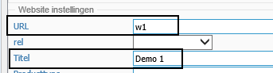

- URL
	- Hier kan je het product een URL geven (deze dient uniek te zijn)
		- Let op gebruik hiervoor geen hoofdletters of andere speciale tekens 
			- *voorbeeld fout: Product 12 cm* / *voorbeeld goed: product-12cm*
- Een titel invullen
	- Dit is je titel voor op de website

----------

