<properties>
	<page>
		<title>handige-weetjes</title>
		<description>handige-weetjes</description>
	</page>
	<menu>
		<position>Modules N - Z / Word Add-In</position>
		<title>Handige weetjes</title>
		<sort>a</sort>
	</menu>
</properties>

# Handige weetjes #

In deze rubriek laten we aan aantal voorbeelden zien voor het aanpassen van documentsjablonen in Hybrid SaaS. Denk hierbij aan factuursjabloon, ordersjabloon, herinneringen enz. Hybrid SaaS maakt gebruik van Microsoft Word voor de opmaak van documenten. Binnen Word zijn tal van mogelijkheden. Wij zullen een aantal functies uitleggen die makkelijk zijn om zelf sjablonen aan te passen.

# Document bewerken, toevoegen en opslaan #

Zoek "**Word sjablonen**"

Selecteer het betreffende sjabloon en klik op "**Bewerken**"

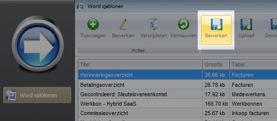

Microsoft Word zal worden geopend en het geselecteerde sjabloon zal worden weergegeven. Aan de rechterkant verschijnt een overzicht van alle velden welke ingevoegd kunnen worden. Afhankelijk van het type "tabel" welke is geselecteerd bij het sjabloon worden de mogelijke velden weergegeven.

In het zoekveld kan worden gezocht op velden welke ingevoegd dienen te worden. Alle benamingen zijn in het Engels. Mocht je een veld niet kunnen vinden neem dan contact met ons op.

Er zijn twee verschillende soorten velden:

- Velden welke op zichzelf staan zoals "ADRES", "FACTUURNUMMER", "FACTUURTOTAAL"

- Velden welke herhaald worden zoals "FACTUURREGELS" en "ORDERREGELS". Deze velden vallen onder een zogenaamde herhalingstabel. Dit betekent dat deze velden enkel werken als deze in een tabel staan en dat de tabel een `MERGEFIELD TABLESTART:` en `MERGEFIELD TABLEEND:` bevat.

Indien het document naar wens ia aangepast dient het document worden geüpload in Hybrid SaaS.

Klik rechtsboven in het Word document op "**Save & Store Template**" 

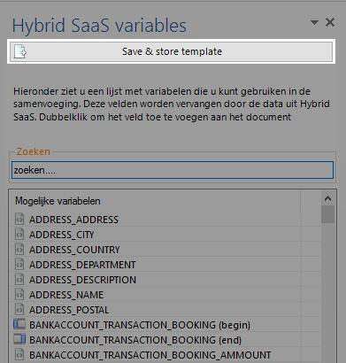

## Basis weetjes voor het bewerken van documenten ##

- ALT+F9 		| Onzichtbare onderdelen zichtbaar maken. Bijvoorbeeld veldcode `«INVOICE_NUMBER»` wordt zichtbaar als `{ MERGEFIELD INVOICE_NUMBER \* MERGEFORMAT }`
- CTRL+F9		| Lege (nieuwe)veldcode invoegen
- CTRL+ENTER 	| Nieuwe Pagina invoegen
- CTRL+A		| Alles Selecteren
- CTRL+C		| Selectie Kopiëren
- CTRL+V		| Selectie Plakken (Met de rechtermuisknop kan ook "speciaal" worden geplakt. Eventuele opmaak van de bron kan dan worden behouden 

## Veldcodes weergeven en bewerken ##

Met ALT+F9 is het mogelijk om de veldcodes weer te geven. Echter is het niet altijd wenselijk om alle codes uit het gehele document weer te geven. Door op een veldcode met de rechtermuisknop te klikken en voor de optie "Andere veldweergave" kan de veldcode zichtbaar worden gemaakt.

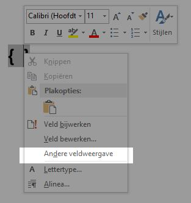

## Tabellen weergeven ##

Om alle informatie op het document netjes onder elkaar weer te geven zal met tabellen gewerkt dienen te worden. Echter is het niet altijd wenselijk om de tabel daadwerkelijk weer te geven op de documentuitvoer.

In Word is de tabel onzichtbaar en is bijvoorbeeld het onderstaande zichtbaar.

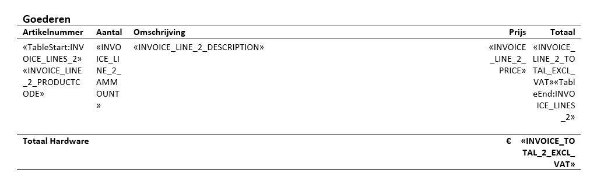

Om de tabellen weer te geven selecteer de optie zoal hieronder weergegeven

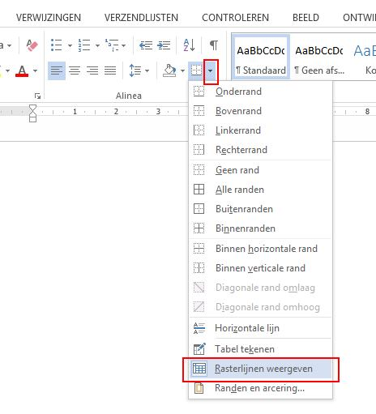

De tabellen (lees rasterlijnen) zullen worden weergegeven. Voer bovenstaande bewerking nogmaals uit om de weergave te herstellen

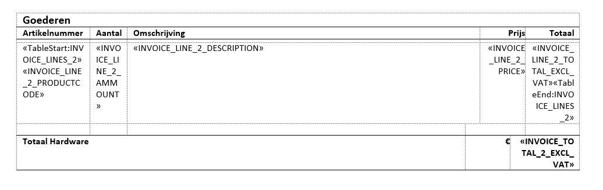

## Tabellen vast breedte laten behouden ##

Om ervoor te zorgen dat de kolommen een vaste breedte behouden en niet van afmeting veranderen kan de kolombreedte vastgezet worden. Klik op de tabel zodat er links bovenin de tabel een icoontje met een kruisje verschijnt. Klik met de **rechtermuisknop** op het icoontje en kies vervolgens "**Auto Aanpassen**" en daarna "**Vaste kolombreedte**"

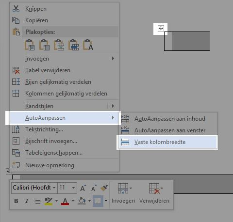

## Aanpassen getal notatie (Angelsaksische en Engelse notatie) ##

Getal notaties voor bijvoorbeeld valuta kunnen op diverse manieren worden weergegeven. Hierin wordt onderscheid gemaakt tussen het karakter voor het scheiden van duizendtallen en het karakter om decimalen weer te geven. In Nederland maken wij gebruik van de Angelsaksische notatie waarbij duizendtallen worden gescheiden d.m.v. een "." (punt) en decimalen d.m.v. een "," (komma). In de Engelse notatie worden deze karakters andersom gebruikt.

Bij de uitvoer van documenten met verschillende talen is het belangrijk dat de documenten goed worden ingesteld. 

### Voorkeursnotatie ###

Ga naar de betreffende MERGEFIELD

Plaats de volgende notatie `\# "§0¤00"` vóór `\*` in het MERGEFIELD

§ = `MERGEFIELDS: CURRENCY GROUP SEPARATOR`

¤ = `MERGEFIELDS: CURRENCY DECIMAL SEPARATOR`

Voorbeeld zonder voorkeursnotatie € 12345,67: `{MERGEFIELD INVOICE_Line_Total_excl_VAT \* MERGEFORMAT}` 

Voorbeeld met voorkeursnotatie (Angelsaksisch) € 12.345,67: `{MERGEFIELD INVOICE_Line_Total_excl_VAT \# "§0¤00" \* MERGEFORMAT}`

Voorbeeld met voorkeursnotatie (Engels) $ 12,345.67: `{MERGEFIELD INVOICE_Line_Total_excl_VAT \# "§0¤00" \* MERGEFORMAT}`

## Informatie verbergen ##

Het kan voorkomen dat iets niet weergegeven dient te worden indien geen data van is. Bijvoorbeeld een "ter attentie van" in een adres. Om ervoor te zorgen dat er geen regel wordt weergegeven is het mogelijk om informatie weg te laten indien er geen data is. Dit kan worden opgelost door een zogenoemd "IF" functie (in het Nederlands ALS). Kort gezegd "als waarde X is, dan moet Y worden weergeven"

Onderstaande afbeelding laat zien dat er een lege regel wordt weergegeven omdat de "t.a.v." niet is ingevuld

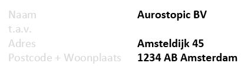

### ALS functie invoegen ###

Voeg een lege veldcode in met **CTRL+F9**

`{ IF "«INVOICE_HEADER»" <> "" "«INVOICE_HEADER»" }` 

<> 	= ongelijk aan

<	= kleiner dan

>	= groter dan

""	= Tekst altijd tussen " (quotes)

Na het toevoegen van de ALS functie zal de lege regel niet worden weergegeven zoals hieronder weergegeven.

De ALS functie kan voor talloze doeleinden worden gebruikt. Het is ook mogelijk om meerdere ALS functies in elkaar te gebruiken.

## Maximaal aantal karakters vastleggen ##

In bepaalde gevallen kan het makkelijk zijn om het aantal karakters te limiteren. Op deze manier wordt voorkomen dat tekstregels te lang worden en daardoor niet meer op een document passen (bijv. een label of sticker).

Door middel van een "maxlength" `/ maxlength=20` toe te voegen aan de MERGEFIELD kan het maximaal aantal karakters worden ingesteld.

Voorbeeld zonder: `{MERGEFIELD PRODUCT_NAME \* MERGEFORMAT}`

Voorbeeld met: `{MERGEFIELD PRODUCT_NAME / maxlength=20 \* MERGEFORMAT}`
 
## Afbeelding een vaste afmeting geven ##

Door middel van een "size" `/ size=100` toe te voegen aan de MERGEFIELD kan een gefixeerde grootte krijgen

Voorbeeld zonder: `{MERGEFIELD IMAGES:ORGANIZATION_IMAGES \* MERGEFORMAT}`

Voorbeeld met: `{MERGEFIELD IMAGES:ORGANIZATION_IMAGES / size=100 \* MERGEFORMAT}`

## Koppen van een tabel herhalen op volgende pagina ##

De kop van een tabel kan in de Kop- en voettekst van een document worden weergegeven. Echter is het ook mogelijk om de bovenste rij(en) op iedere pagina te herhalen.

Klik met de rechtermuisknop op de rij welke herhaald dient te worden. Ga naar **Tabeleigenschappen** > Tabblad **Rij** > Zet het vinkje aan voor **Rij als veldnamenrij herhalen bovenaan op iedere pagina**

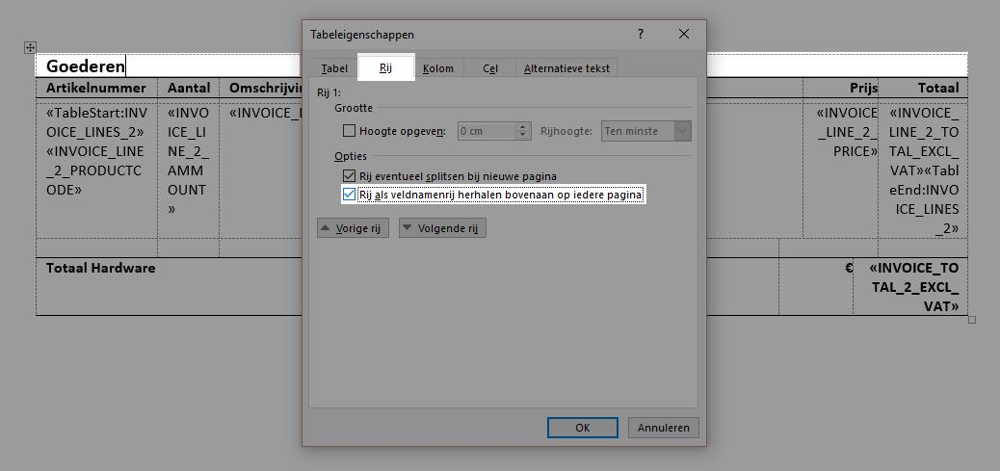

## Tekstterugloop bij tabellen ##

Het kan voorkomen dat een tabel niet op de juiste plek of soms helemaal niet wordt weergegeven, wanneer deze wordt omgezet naar een pdf.

Om dit voorkomen dient de tekstterugloop van de tabel uitgeschakeld te worden.

Klik met de rechtermuisknop op de tabel. Ga naar **Tabeleigenschappen** > Tabblad **Tabel** > Selecteer bij tekstterugloop **"Geen"**

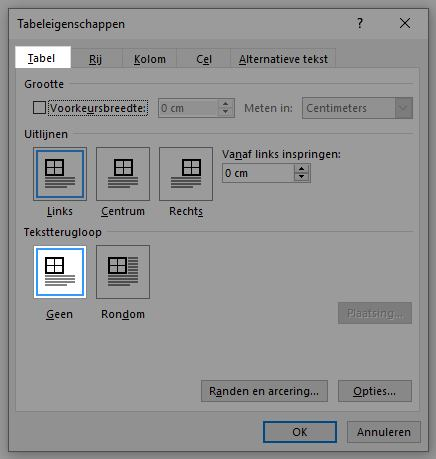

## Sjablonen testen ##

Soms is het niet duidelijk of een wijziging goed is doorgevoerd, of waarom bepaalde data niet correct wordt weergegeven. Het is mogelijk om vanuit Hybrid SaaS een document op te maken in Word.

Klik op een record en kies vervolgens voor "**Document opmaken**" 

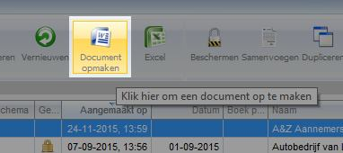

Klik op het sjabloon welke getest dient te worden

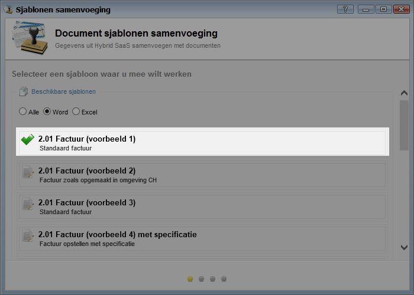

Het sjabloon waar een vinkje voor staat is het sjabloon wat standaard wordt gebruikt bij de geselecteerde relatie.

Zet het vinkje voor "**Microsoft Word**", kies het bestandstype "**Word Document (*.docx)**" en klik vervolgens op "**Start Samenvoeging**"

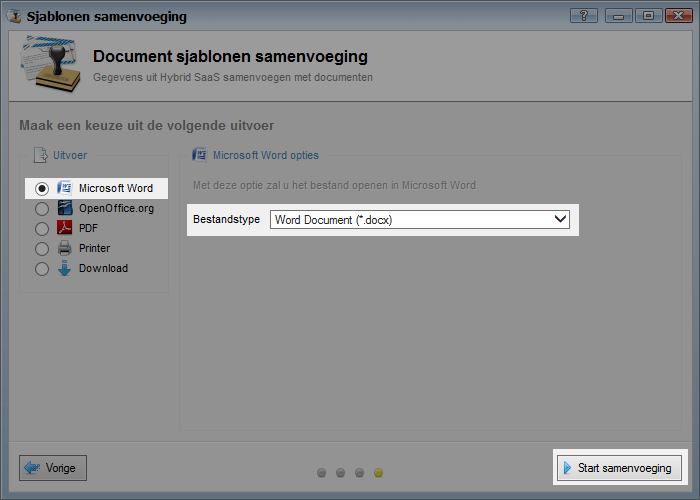

Door de veldcodes (door middel van ALT+F9) weer te geven kan worden bekeken waarom een bepaald veld een bepaalde waarde geeft.

Naast de uitvoer in Word is het ook mogelijk om bijvoorbeeld pdf als uitvoer te kiezen.

--------

