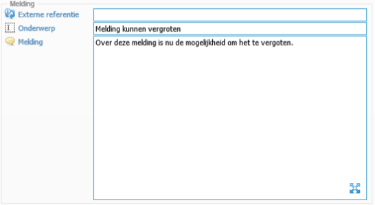

<properties>
	<page>
		<title>Release notes volgende versie</title>
	</page>
	<menu>
		<position>Release notes</position>
		<title>Volgende versie</title>
	</menu>
</properties>

# Release notes volgende versie #

In de release notes staan de wijzigingen voor de volgende productieversie van Hybrid SaaS.

De beschreven aanpassingen zijn nog niet algemeen beschikbaar. De volgende release van Hybrid SaaS zal deze functionaliteiten bevatten.

## Modules ##

**Uitzetten module**

Bij het uitzetten van een module werden soms de rechten niet correct aangepast. Na deze update zullen de juiste rechten aangepast worden.

## Ticket ##

**Het vergoten van de melding**

Er is een mogelijkheid gemaakt om het scherm van de melding te kunnen vergroten zodat de tekst beter leesbaar is.

**Vreemde taal of tekens**

Een email doorzetten naar een ticket gaf o.a. Chinese tekens (unicode) niet goed weer. Dit is opgelost.
 
**Extra veldcodes**

Er zijn 2 nieuwe veldcodes toegevoegd om te gebruiken: 

* `[%TICKET_TYPE%]` hierbij kan je de type van het ticket vermelden
* `[%TICKET_CUSTOMER_CODE%]` hierbij kan je de klantnaam vermelden

## Tijdregistratie ##

**Reisduur werd meegerekend in de totale interne uren**

Bij het aanmaken van een Tijdregistratie werd de reisduur meegerekend bij de interne uren, deze werden ook doorberekend op de factuur. Dit is verholpen. 
Je kan de duur registeren, alleen de reiskosten die ingevuld worden, worden nu door belast, en eventuele kilometer vergoeding. De reisduur is voor intern gebruik.

## Cloud ##

**Geen juiste weergave op de mobiele versie**

Bestanden in de cloud weergave werden niet goed geopend op mobiele apparaten omdat de mimetype niet gezet was.
Er zijn aanpassingen gedaan in de changelog
